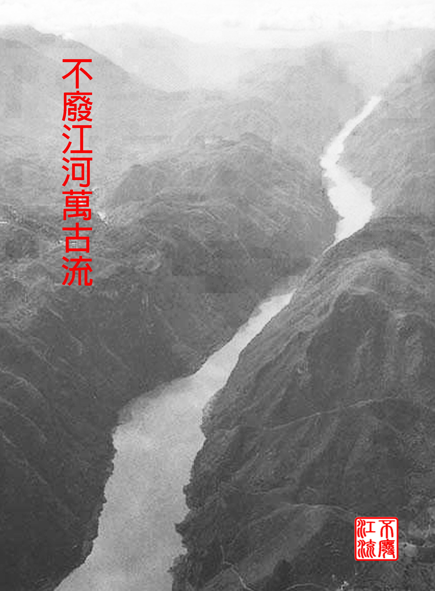

当我看到，一切生长之物。

只在刹那间能够完美；

世界舞台上一无所有，

唯有星辰在秘密中牵引。

我看到人类像草木一样生长，

被同样的天空赋予盛衰。

少时繁茂，日中则仄，

一切美好都从记忆中被抹去！

于是这瞬间停留的诡计。

让你青春的盛容出现在我面前。

残暴的时间和腐朽商议，

要把你青春的白日变成暗淡的黑夜——

为了爱你，我将和时间对抗，

它从你身上夺走的，我会重新嫁接。

